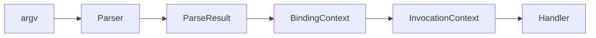

# System.CommandLine (Experimental)

> [!WARNING]
> This API is currently **experimental** and in preview. It may undergo significant breaking changes before a stable 1.0.0 release.

## Overview

`System.CommandLine` is a robust, architecturally hardened infrastructure for building Command Line Interfaces (CLIs) in the `dotnet-node-core` framework. It follows a strict separation of concerns between structural parsing, data binding, and handler execution.

## Architectural Model

The framework enforces a serialized execution pipeline to guarantee determinism and testability:

1.  **Parsing (Structural Layer)**: Matches raw `argv` tokens against the command tree. It produces a `ParseResult` containing raw matches but performs no type conversion or side effects.
2.  **Binding (Data Layer)**: Resolves raw tokens into typed values (e.g., `CsInt32`, `CsGuid`, `boolean`). This is handled by the `BindingContext`, which also enforces arity and validation rules.
3.  **Execution (Boundary Layer)**: The `InvocationContext` provides the execution environment, including access to Dependency Injection (DI) services, and triggers the command handler.



## Basic Usage

### Defining a Command

```typescript
import { System } from "dotnet-node-core";
const { CommandLine } = System;

const rootCommand = new CommandLine.RootCommand("My App")
    .AddOption(CommandLine.Option.From<boolean>("--verbose", "Enable logging"))
    .AddArgument(CommandLine.Argument.From<string>("name", "The user name"));
```

### Executing the Pipeline

```typescript
const parser = new CommandLine.Parser(rootCommand);
const parseResult = parser.Parse(process.argv.slice(2));

if (parseResult.IsSuccessful.Value) {
    const binding = CommandLine.BindingContext.From(parseResult);
    const invocation = new CommandLine.InvocationContext(binding, parseResult.Command, services);
    await invocation.Invoke(); // Triggers the handler
}
```

## Core Components

### Symbols
All CLI entities (Commands, Options, Arguments) inherit from `Symbol`. Symbols are strictly metadata containers and are immutable.

### Options
Named parameters that usually start with a prefix (e.g., `--verbose`, `-v`). They support aliases and default values.

### Arguments
Positional parameters defined by their order in the command line. They support arity configurations (e.g., `SetArity(1, 1)` for required values).

### BindingContext
The source of truth for resolved values. Use `GetValueForOption<T>` or `GetValueForArgument<T>` within your handlers to retrieve type-safe data.

## Quality and Stability
- **Immutability**: All core types are structurally immutable.
- **Deterministic**: Localized side effects and pure parsing logic.
- **Type Safe**: Minimal use of `any`, restricted to infrastructure boundaries with explicit architectural justification.
